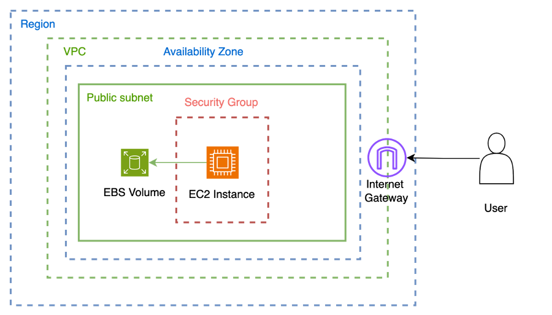

# EC2 Notes

Amazon Elastic Compute Cloud (EC2) is a way to run virtual servers in cloud.

EC2 Host server or EC2 Hosts ( Physical hardware of the EC2 service) is maintained and managed by Amazon AWS.

EC2 Instance is a virtual server managed by users, which runs on top of EC2 Hosts.

## EC2 Instance Type

EC2 Instance type (Hardware profile) is a combination of CPU, Memory, Storage and Networking.

Each instance type is targeted for certain types of work load.

| Category | Families | Purpose/Design |
| ----------- | ----------- | ----------- |
| General Purpose | Mac, T4g, T3, T3a, T2, M6g, M6i, M5, M5a, M5n, M5zn, M5, A1 | General Purpose Instances provide a balance on compute, memory, and networking resources, and can be used for a variety of diverse workloads. |
| Compute Optimized | C6g, C6gn, C6i, C5, C5a, C5n, C4 | Compute optimized are ideal for compute bound applications that benefit from high performance processors. |
| Memory Optimized | R6g, R5, R5a, R5b, R5n, R4, X2gd, X1e, X1, High Memory, z1d | Memory optimized instances are designed to deliver fast performance for workloads that process large data sets in memory. |
| Accelerated Computing | P4, P3, P2, DL1, Inf1, G5, G4dn, G4ad, G3, F1, VT1 | Accelerated Computing instances use hardware accelerators, or co-processors to perform functions such as floating-point number calculations, graphics processing, or data pattern matching. |
| Storage Optimized | I3, I3en, D2, D4, D3en, H1 | This instance family provides Non-Volatile Memory Express (NVMe) SSD-Backed instance storage optimized for low latency, very high random I/O performance, high sequential read throughput and high IOPS at a low cost. |

EC2 instance can run different OS (windows, linux, macos).

Amazon Machine Image (AMI) defines the configuration (instance type + OS + user config) of the instance.

EBS snapshot is a point in time backup of an instance. AMI can be created from EBS snapshot and is called customised AMI.

## EC2 Service

EC2 is a regional service. 

EBS Volume
: Data is virtual hard drive attached to instance.

Security Group
: Specific rules that controls the inbound and outbound traffic to the instance.

Internet Gateway
: Gateway enables access to and from the internet.

## EC2 Instance Launch and Connection

For launching EC2 instance in AWS console following are the steps

Locate EC2 service in the dashboard. Once in EC2 service dashboard click on "Launch Instance" button.
- Select the AMI and OS. We can select the customised AMI here.
- Select the instance type.
- Select or create a key pair. Key pair is used to securely login into the instance. Its created for particular region.
- Select the VPC, sub net and enable public ip.
- Select or create the security group.
- Select the storage (EBS volume).

| SSH/Putty | RDP | EC2 Instance Connect | Session Manager |
| ----------- | ----------- | ----------- | ----------- |
| All operating systems. Linux, Mac by default have SSH. For Windows client we use Putty  | Windows only | All operating systems. |All operating systems. |
| Terminal/CLI | Desktop/ GUI | Terminal/CLI/Browser | Terminal/CLI |
| SSH daemon | Remote Desktop Service | SSH daemon | SSH agent |
| Uses instance key pair | Requires RDP client | Temporary key pair | IAM access control |
| Port 22(of client and instance) must be open | Port 3389 must be open | Port 22 must be open | No Ports must be open |
| Anyone with key pair can access instance | Need username and password to login | IAM access control via policy | IAM access control via policy |

## EC2 User Data and Metadata

EC2 User Data
: User data is code that runs when the instance starts for the first time.

- User data is limited to max 16 kb of code(usually bash script).
- Batch and PowerShell scripts can be run on Windows.

EC2 Meta Data
: Information about instance is available at http://169.254.169.254/latest/meta-data/

- The IP is a local ip and can be accessed only after connecting to the system.

## EC2 Accessing Services

Access Keys
- Each instance already has AWS CLI. AWS CLI is configured with access keys
- The access key is associated with an IAM user account.
- The access key will use permissionns assigned to the IAM user.
- Down side is access keys are stored on Instance file system which can pose a security risk.

EC2 Instance Profile
- Create IAM role and add required policies.
- Attach IAM role to the instance.
- The role is assumed by the EC2 instance to perform necessary actions.
- No credentials are stored on the instance file system.

## EC2 Placement Groups

Availabitity zone consists of one or more data centers.

Cluster
: Packs instances close together inside an availability zone. This strategy enables workloads to achieve the low-latency network performance necessary for tightly-coupled node to node communication that is typical of HPC applications.

Partition
: Spreads your instances accross logical partitions such that groups of instances in one partition do not share the underlying hardware with groups of instances in different partitions. This strategy is typically used by large distributed and replicated workloads, sucha as Hadoop, Cassandra, and Kafka.

- Amazon EC2 ensures that each partition within a placement group has its own set of racks.
- Each rack has its own network and power source. No two partitions within a placement group share the same racks, allowing you to isolate the impact of hardware failure within your application.
- Partition placement groups can be used to deploy large distributed and replicated workloads, such as HDFS, HBase, and Cassandra, across distinct racks.
- Partition placement groups are not supported for Dedicated Hosts

Spread
: Strictly places a small group of instances across distinct underlying hardware to reduce correlated failures. Maximum of 7 instances running per group, per AZ
